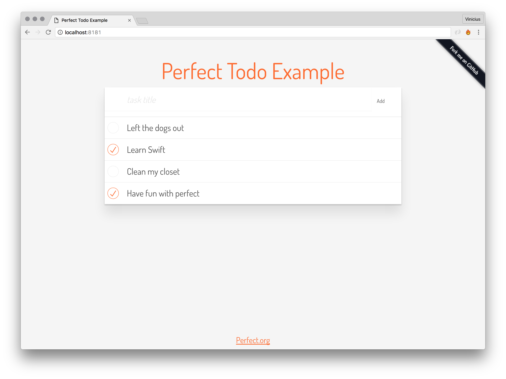

# Perfect Todo List Example


[](http://makeapullrequest.com)




A simple todo list written with Swift [Perfect](http://perfect.org).

This example illustrates how to create a simple todo list with Swift Perfect, persisting data on MySQL database.

Check out the [live demo](http://bit.ly/2ebnw8T) running on AWS ElasticBeanstalk.

## Installation

It's recommended to use Swift 3.0.1

then setup your MySQL credentials on `Sources/Database.swift`

```swift
  let mysql = MySQL()
  let host = "127.0.0.1"
  let user = "root"
  let password = ""
  let db = "todo_perfect"
  let table = "todo"
```


`database.sql` file has instructions to create database and tables with sample data:

example: `mysql -u yourusername -p yourpassword yourdatabase
< database.sql `

after all, just run:

`make run`

## License

[MIT License](http://vsouza.mit-license.org/) © Vinicius Souza
